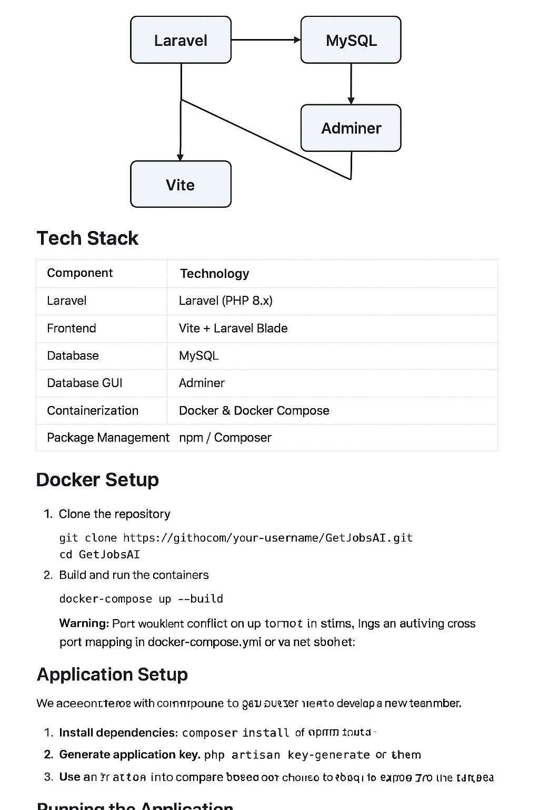

# 🧠 GetJobsAI

**GetJobsAI** is an intelligent job discovery and management platform that leverages AI-powered recommendations to help users find the best job opportunities based on their preferences, skills, and market trends.  

Built with **Laravel**, **MySQL**, and **Vite**, the project uses Docker for containerized deployment, ensuring consistency across environments and easy setup for developers.

---

## 🚀 Features

- AI-assisted job recommendations  
- User authentication and profile management  
- Job search and filtering  
- Modern and responsive UI built with Vite and Laravel Blade  
- Dockerized environment for easy setup and deployment  
- Integrated Adminer for database management

---

## 🧩 Tech Stack

| Component | Technology |
|------------|-------------|
| Backend | Laravel (PHP 8.x) |
| Frontend | Vite + Laravel Blade |
| Database | MySQL |
| Database GUI | Adminer |
| Containerization | Docker & Docker Compose |
| Package Management | npm / Composer |

---

## 🐳 Docker Setup

### 1️⃣ Clone the repository

## 🧩 System Architecture

The diagram below illustrates how the **Dockerized stack** of GetJobsAI works, showing interactions between the Laravel app, MySQL database, Adminer interface, and Vite frontend.




```bash
git clone https://github.com/<your-username>/GetJobsAI.git
cd GetJobsAI


